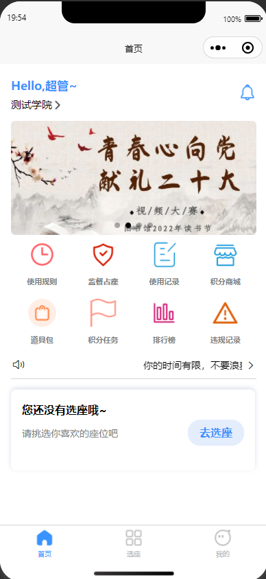

# 图书馆座位预约小程序

#### 介绍

图书馆座位预约小程序, 可以拿来做毕业设计，课程设计等等

### 请留下你的Star

#### 软件架构

软件架构说明

本系统总共三个项目构成：

后端：SPring Boot + Mybatis Plus  数据库：MySQL
小程序： Uni-app  vue.js 2.x  
后台管理系统： 在Vue Element Admin框架二次开发 ，开发语言为 vue.js 2.x

### 项目截图
#### 小程序端

#### 后台管理系统

#### 后端

## 联系作者
微信：xtb365 可提供源码、技术咨询等等，  备注来意

